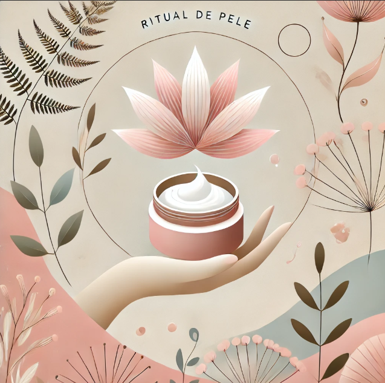

    preview do podcast

    <audio src="output/podcast_editado.MP3" controls title="Podcast editado"></audio>

# Projeto Podcast Gerado por I.A.s

 > ℹ️ **NOTE:** Este é o repositório desenvolvido durante uma live no Youtube em parceria com a [DIO](https://dio.me)

Projeto com o objetivo de gerar um podcast utilizando ferramentas de IA através de prompts mais trabalhado.

Utilizer uma esteira de prompts para gerar cada etapa do processo criativo.

## 💻 Tecnologias utilizadas no projeto

- [ChatGPT](https://chat.openai.com/) 
- [veed](https://www.veed.io/)
- [Smart Audio Baixar Capture](https://chromewebstore.google.com/detail/smart-audio-capture/lfohcapleakcfmajfdeomgobhecliepj?hl=pt-BR&utm_source=ext_sidebar)

## ✨ Como foi feito ?

- Roteiro gerado via chatgpt
- Audio gerado via chatgpt
- chatgpt Para gerar capas
- veed para tratar aúdio e adicionar sons de fundo

## 📚 Materiais

- [Link da live no Youtube](https://www.youtube.com)

## 🛠️ Instruções de execução

Utilize os prompts do `chagpt` para criar o roteiro, antes de criar o roteiro treinar a sessão para entender que ele estará em um universo de podcast, após o primeiro treino pedir a referência dos melhores podcast, criar o roteiro, então seguir passo a passo a orientação da IA. Incluir a dinâmica entre locutores, após a conclusão criar a capa. usar o veed para juntar todos os audios. E done.

- 🤖 1. Use os prompts de roteiro no `chagpt`
- 🤖 2. Use os prompts de artes no `chagpt`
- 🤖 3. Use o veed para baixar o auio do `chagpt`

[evidência do prompt]

## 👨‍💻 Expert

---

⌨️ com 💜 por [Sóllon Soares](https://github.com/SollonSoares)
